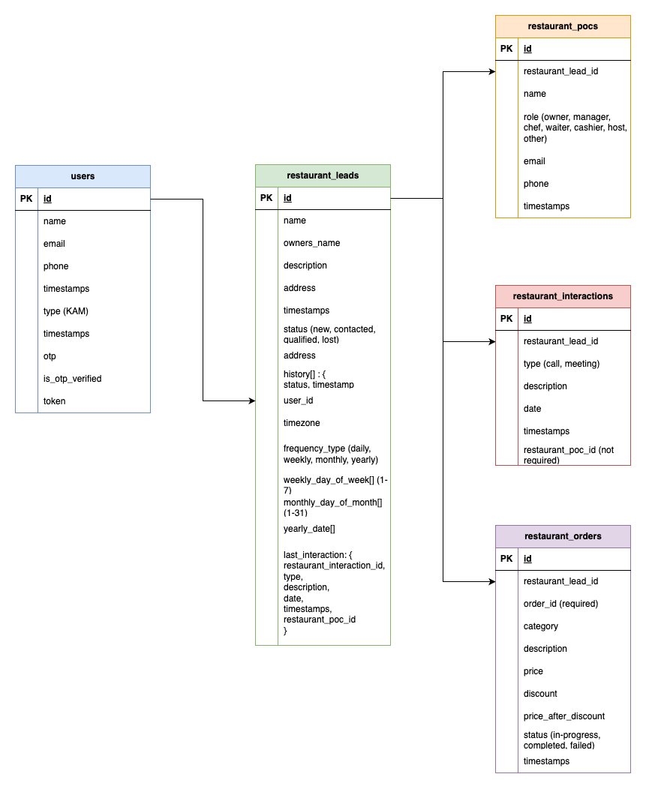

# KAM Lead Management System

## Project Overview
Udaan, a B2B e-commerce platform, requires a Lead Management System for Key Account Managers (KAMs) who manage relationships with large restaurant accounts. This system will help track and manage leads, interactions, and account performance.

---

## System Requirements
Ensure your system meets the following requirements before proceeding:

- **Node.js**: v21.2.0 or higher
- **npm/yarn**: Latest version
- **MongoDB**: v4.0 or higher (for backend database)
- **Browser**: Chrome/Edge/Firefox (latest version)
- **Operating System**: Windows/Linux/MacOS (any with appropriate Node.js support)

---

## Installation Instructions
In Github, client & server reside under the same directory, so just clone the parent one.
1. Clone the repository:
   ```bash
   git clone https://github.com/your-repo-url.git

### Backend (BE)

1. Change directory:
    ```bash
    cd server
2. Install dependencies:
   ```bash
   npm install
3. Set up environment variables:
    - Copy server/.env.example to server/.env
    - Update .env with appropriate values for your local setup.
    - Make sure, you add Mongo DB URL
4. Start the backend server:
    ```bash
   npm run dev


### Frontend (FE)

1. Change directory:
    ```bash
    cd client
2. Install dependencies:
   ```bash
   npm install
3. Start the clinet:
    ```bash
   npm run dev

## Running Instructions
Once setup is done, db string is updated in the env, we are ready to go, we can now start our server
### Backend (BE)
-  Start the backend server: (starts at 3000 PORT)
    ```bash
   npm run dev

### Frontend (FE)
-  Start the backend server:
    ```bash
   npm run dev

## DB Schema

